**Viz-Compiler** is a custom-built native compiler for **VizLang( .rv)**, a minimal C-like language designed as a complete, pedagogically clear compiler construction reference.

It compiles VizLang source through every classical stage:

```

Source (.rv)
→ Lexer (Flex)
→ Parser (Bison)
→ Semantic Analysis
→ IR Generation (Quads)
→ Optimization
→ x86-64 Assembly

```

---

## ⚠️ Important Rules (READ FIRST)

### 🔴 VizLang is NOT C
- ❌ Do NOT use `.c`
- ❌ Do NOT use gcc
- ✔ Use `.rv`
- ✔ Custom compiler only

---

### 🔴 main() is Mandatory

```

int main() {
return 0;
}

```

---

### 🔴 Negative Return Rule

❌ Wrong:
```

return -1;

```

✔ Correct:
```

return 0 - 1;

```

---

### 🔴 repeat Loop (Custom)

```

repeat(5 * 2) {
print("Runs 10 times");
}

```

---

### 🔴 for Loop Rule

✔ Correct:
```

for (int i = 0; i < 5; i = i + 1)

```

❌ Avoid:
```

int i;
for (i = 0; i < 5; i = i + 1)

```

---

Here is the **corrected and clean professional version** of your section:

---

## ⚙️ Usage

### Create a Test Folder

```bash
mkdir tests
cd tests
```

### Create a Test File

Create a file with any name (for example):

```
demo.rv
```

---

### Start the Extension

```
Ctrl + Shift + P → Start Viz Container
```

---

### Compile

```bash
make run FILE=demo.rv
```

---

### Exit the Container

```bash
exit
```

---

### Stop the Container

```bash
docker stop viz
```

---


# 📌 1. Project Goals & Architecture

## Goals
- Full Pipeline Visibility
- Memory-to-Memory CodeGen
- Hardware Hooks (`sort()`)

## Compiler Pipeline
```

Source → Lexer → Parser → AST → IR → Optimizer → Assembly

```

---

# 📌 2. VizLang Specification

## Data Types
```

int x = 10;

```

## Pointers
```

int *p = &x;
*p = 20;

```

## Arrays
```

int arr[5];

```

## Operators
| Category | Operators |
|----------|----------|
| Arithmetic | + - * / |
| Relational | == != < > <= >= |
| Logical | && || |
| Memory | & * |

---

# 📌 3. Functions & Recursion

## Pass-by-Value
```

int factorial(int n) {
if (n <= 1) return 1;
return n * factorial(n - 1);
}

```

## Pass-by-Reference
```

void inc(int *x) {
*x = *x + 1;
}

```

---

# 📌 4. Built-in Hooks

```

print(x);
input(x);
printarray(arr);
sort(arr,5);

````

---

# 📌 5. IR Instruction Set

IR_MOV, IR_ADD, IR_SUB, IR_MUL, IR_DIV, IR_SHL, IR_SHR, IR_IF_FALSE, IR_GOTO

---

# 📌 6. Optimization

- Constant Propagation  
- Constant Folding  
- Strength Reduction  
- Dead Code Elimination  

---

# 📌 EXAMPLES + VISUALIZATION

---

## 🔹 Area (Pointers)

```c
int calculate_area(int* a , int* b) {
    int length=*a;
    int width=*b;
    print("Inside the calculate_area function");
     int offset = 12 + 67; 
     int base_area = (length * width) + offset;
     int scaled_area = base_area * 1; 
    int final_result = scaled_area + 0;
     return final_result;
}

int main() {
    int l = 10;
    int w = 5;
    int area = calculate_area(&l, &w);
    print("The calculated area is:");
    print(area);
    return 0;
}
```

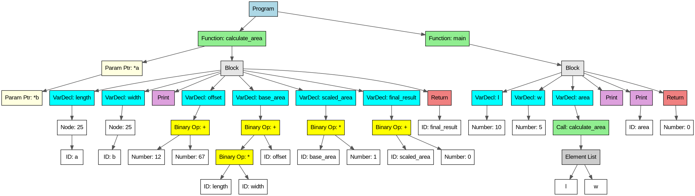
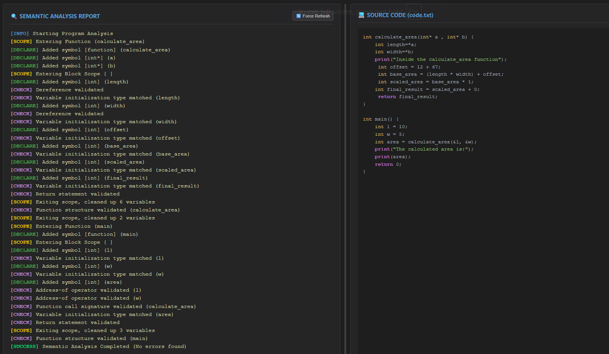
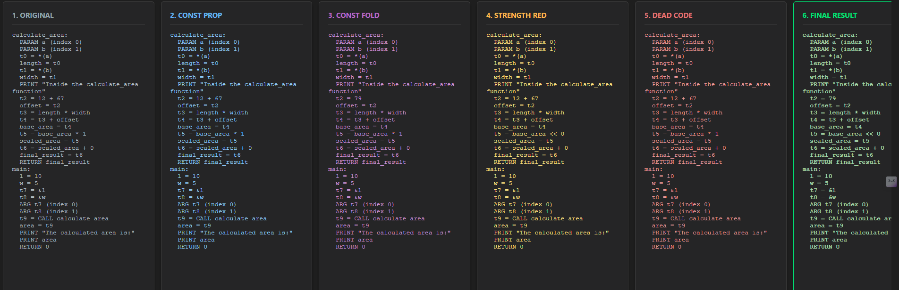
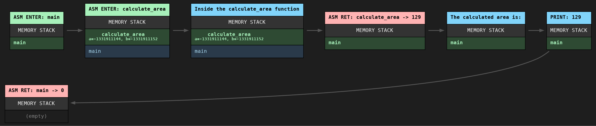

---

## 🔹 Insertion Sort

```c
void insertion_sort(int arr[], int n) {
  //  int i=0;
    /* Outer Loop: Iterate through the array */
    for ( int i = 1; i < n; i = i + 1) {
        
        print("--- Checking Index ---");
        print(i);

        /* Inner Loop: Bubble the element backwards into correct spot */
        /* Syntax: for ( int j=i; condition; update ) */
        for (int j = i; j > 0 ; j = j - 1) {
            if(arr[j-1] > arr[j]){
            /* Swap arr[j] and arr[j-1] */
            int temp = arr[j];
            arr[j] = arr[j-1];
            arr[j-1] = temp;

            print("<< Swapped Backwards");}
        }
    }
}

int main() {
    int my_arr[5] = {12, 11, 13, 5, 6};
    int b= 2+3;
    int z=100;

    print("--- Starting Insertion Sort (Nested For Loops) ---");
    insertion_sort(my_arr, 5);

    print("--- Final Sorted Array ---");
    for (int k = 0; k < 5; k = k + 1) {
        print(my_arr[k]);
    }

    return 0;
}
```

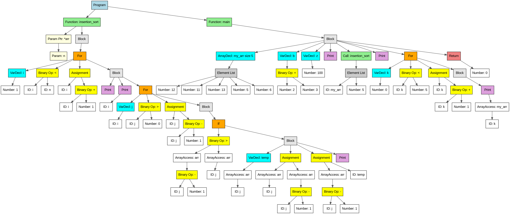
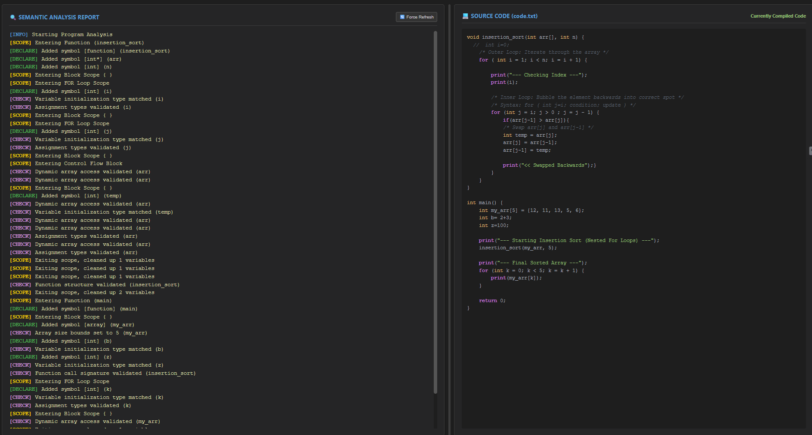
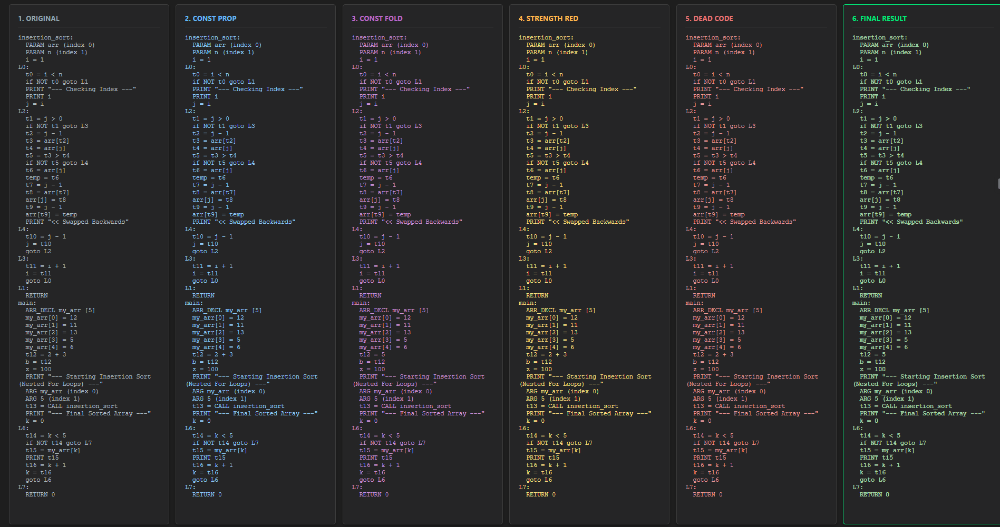
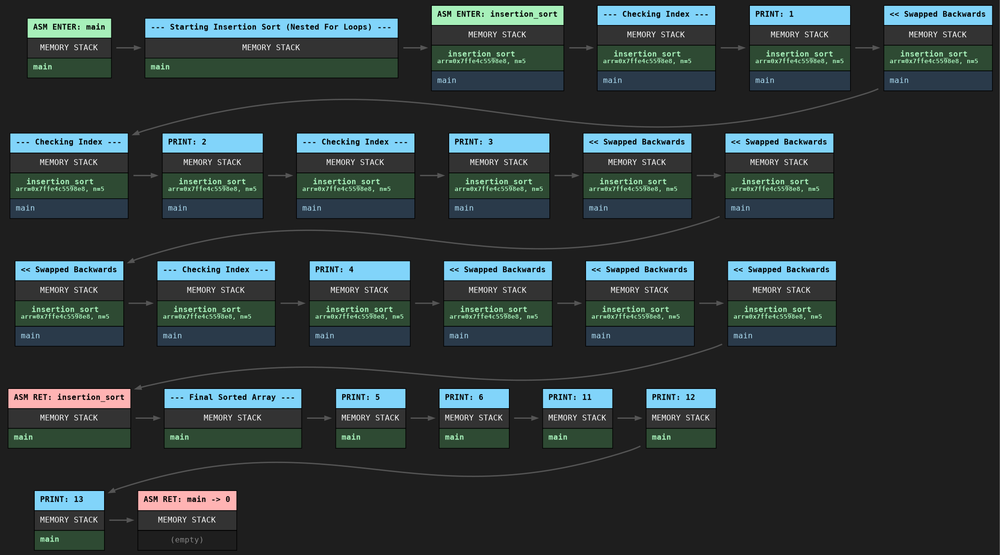

---

## 🔹 Recursive Sum

```c
int sumArray(int arr[], int n) {
    /* Base Case: if size is 0, sum is 0 */
    if (n == 0) {
        return 0;
    }

    /* Recursive step: current element + sum of remaining */
    return arr[n - 1] + sumArray(arr, n - 1);
}

int main() {
    /* Define array with size 5 */
    int h=0;
    int arr[5] = {1, h, 3, 4, 5};
    int n = 5;
    
    print("--- Calculating Recursive Sum ---");
    
    int ans = sumArray(arr, n);
    
    print("Total Sum:");
    print(ans);
    
    return 0;
}
```

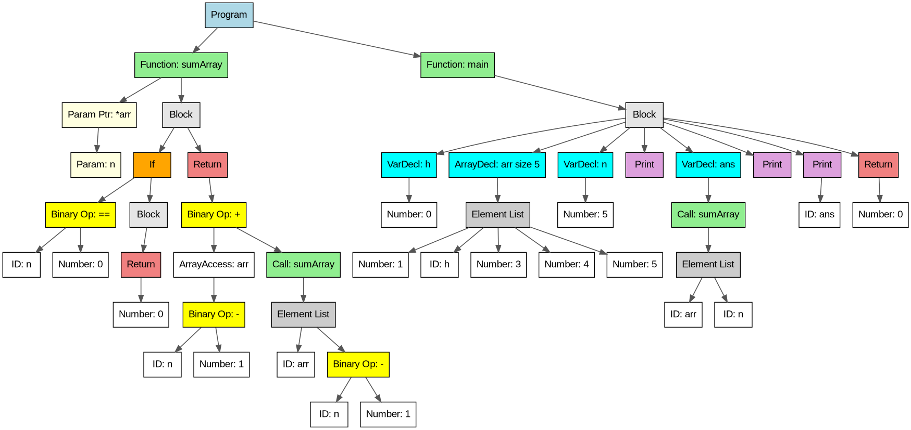
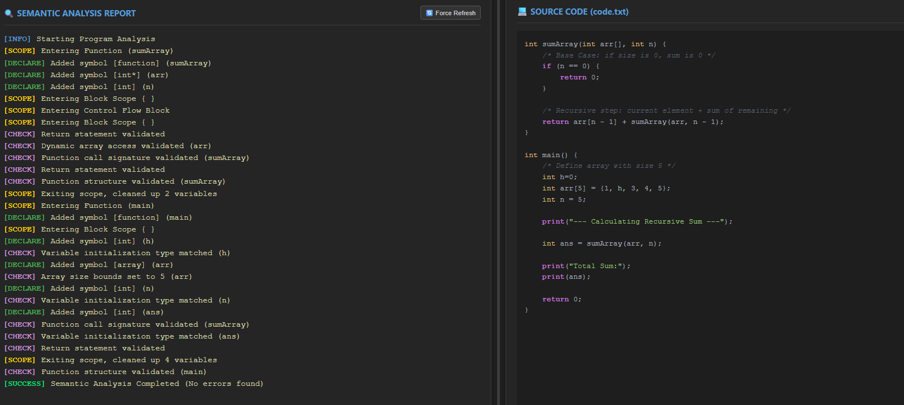
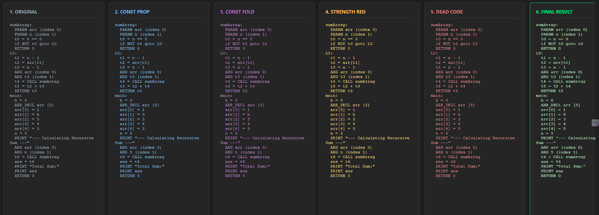
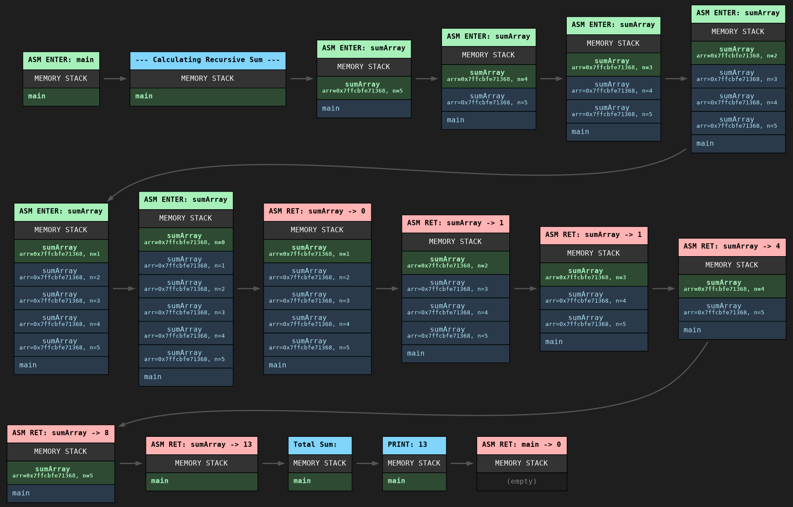

---

## 🔹 Pointer Swap

```c
/* tests/pointer.rv */

void swap(int *a, int *b) {
    print("--- Swapping Values via Pointers ---");
    
    /* Dereference to get value */
    int temp = *a;
    
    /* Dereference to assign value */
    *a = *b;
    *b = temp;
}

int main() {
    int x = 10;
    int y = 20;

    print("Before Swap:");
    print(x);
    print(y);

    /* Pass Addresses */
    swap(&x, &y);

    print("After Swap:");
    print(x);
    print(y);

    return 0;
}
```

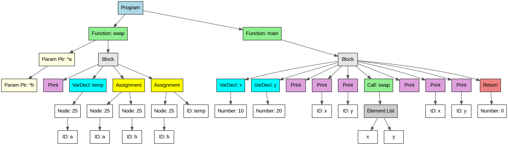
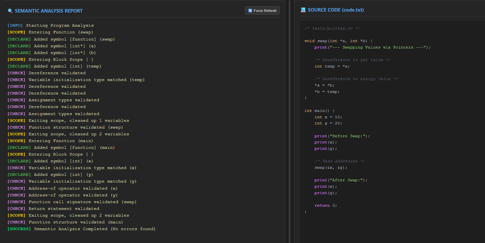
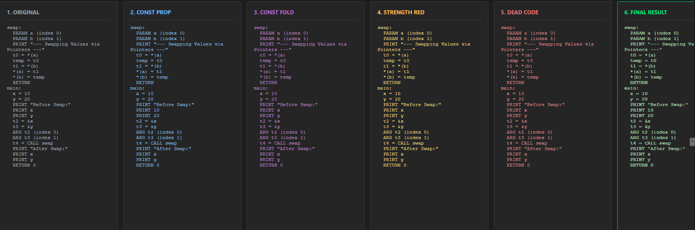
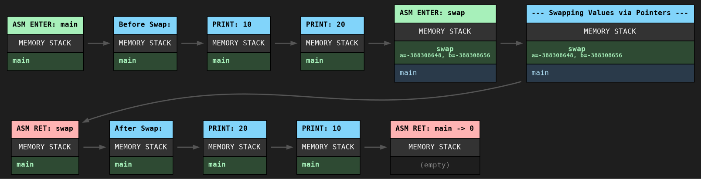

---

## 🔹 Tower of Hanoi

```c
/* tests/hanoi.rv */

void hanoi(int n, int from_rod, int to_rod, int aux_rod) {
    if (n == 1) {
        print("Move disk 1 from rod");
        print(from_rod);
        print("to rod");
        print(to_rod);
        return;
    }
    
    /* Move n-1 disks from A to B */
    hanoi(n - 1, from_rod, aux_rod, to_rod);
    
    /* Move nth disk from A to C */
    print("Move disk from rod");
    print(from_rod);
    print("to rod");
    print(to_rod);
    
    /* Move n-1 disks from B to C */
    hanoi(n - 1, aux_rod, to_rod, from_rod);
}

int main() {
    int n = 3; /* Number of disks */
    print("--- Tower of Hanoi (3 Disks) ---");
    
    /* Rods are represented by integers: 1, 2, 3 */
    hanoi(n, 1, 3, 2);
    
    return 0;
}
```

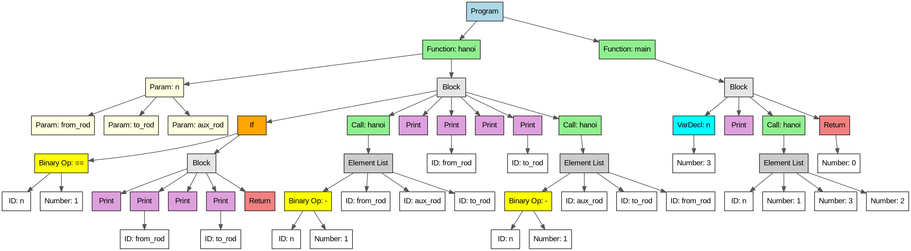
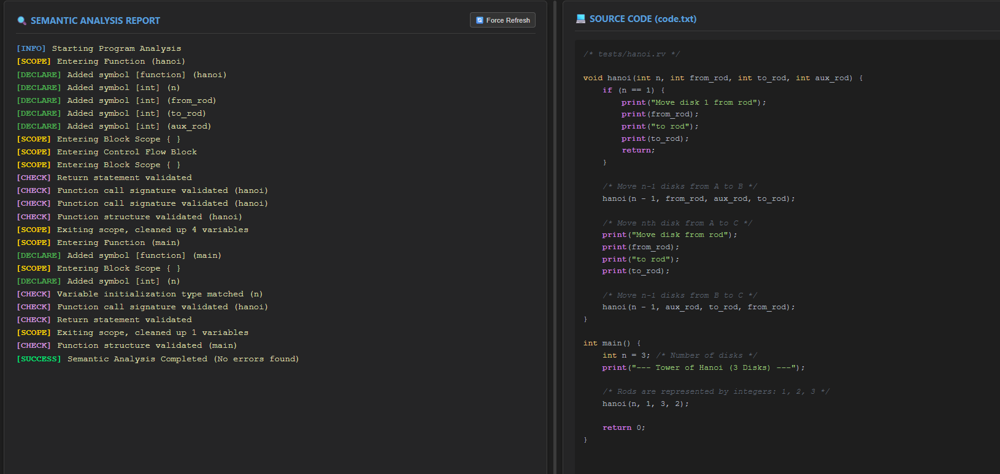
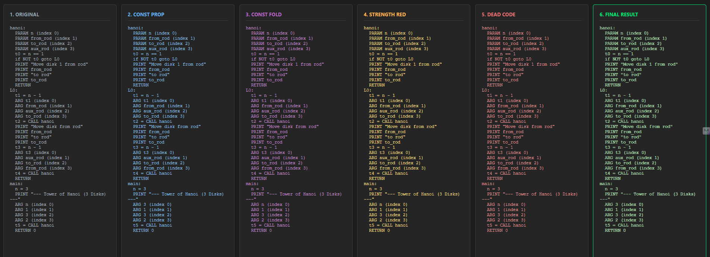
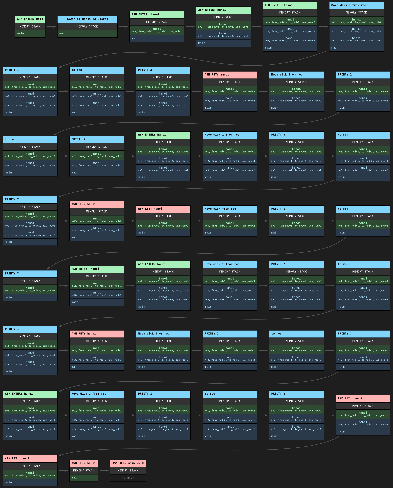

---

## 🔹 Binary Search

```c
int binarySearch(int arr[], int l, int r, int key) {
    /* 1. Declare variable at the top */
    int mid;

    /* Base Case: Element not present */
    if (l > r) {
        return 0-1;
    }

    /* 2. Assign value using math in a separate statement */
    mid = (l + r) / 2;

    /* Case 1: Key found at mid */
    if (arr[mid] == key) {
        return mid;
    } 
    else {
        /* Case 2: Key is smaller, search left half */
        if (key < arr[mid]) {
            return binarySearch(arr, l, mid - 1, key);
        }
        /* Case 3: Key is larger, search right half */
        else {
            return binarySearch(arr, mid + 1, r, key);
        }
    }
   // return 0;

}

int main() {
    int arr[5] = {1, 3, 5, 7, 9};
    int n = 5;
    int target = 7;
    int result;

    print("--- Starting Binary Search ---");
    print("Target Value:");
    print(target);

    /* Initial call: range is 0 to n-1 */
    result = binarySearch(arr, 0, n - 1, target);

    if (result == 0 - 1) {
        print("Element not found");
    } else {
        print("Element found at index:");
        print(result);
    }

    return 0;
}

```

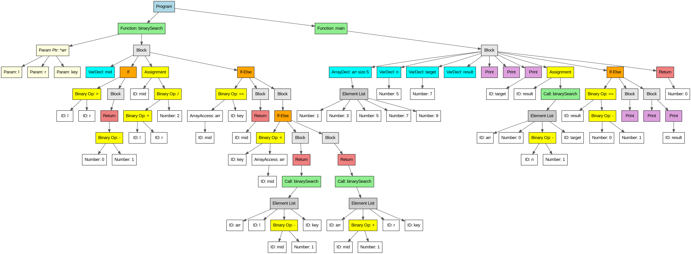
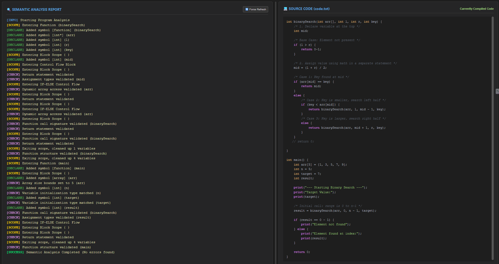
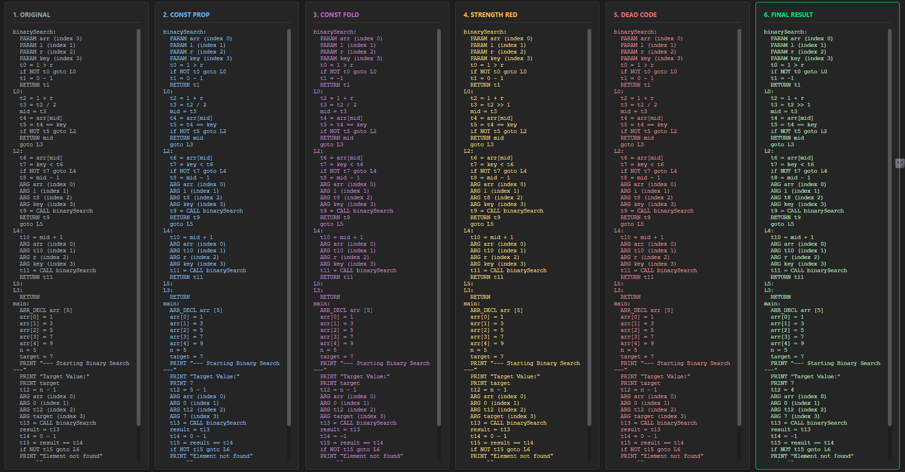
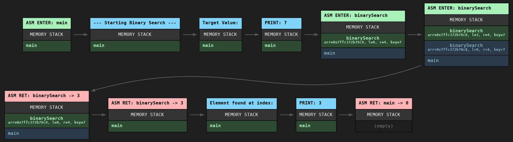

---

# ⚠️ Disclaimer

Educational purpose only.

---
